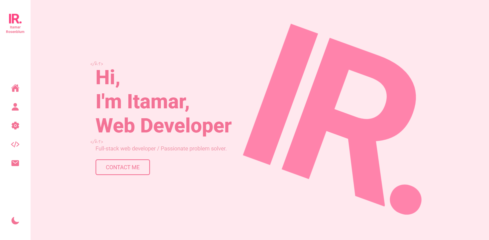
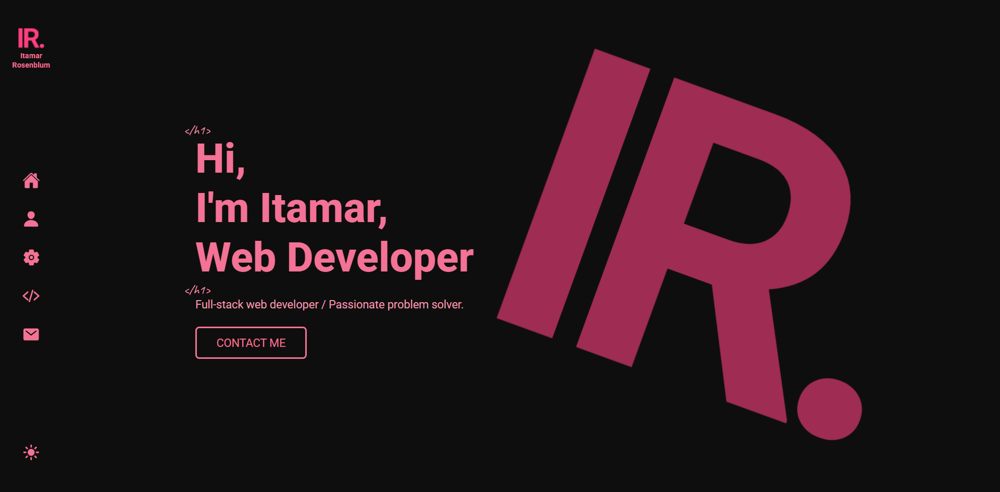

# HackerU - Personal Portfolio Project

This is a solution to the Personal Portfolio project on HackerU. This project served as an excellent exercise to practice Front-end Development principles, focusing heavily on responsive design and modern CSS techniques, which are key areas of my personal developer portfolio.

## Table of contents

- [Overview](#overview)
  - [The challenge](#the-challenge)
  - [Screenshot](#screenshot)
  - [Links](#links)
- [My process](#my-process)
  - [Built with](#built-with)
  - [Continued development](#continued-development)
  - [Useful resources](#useful-resources)
- [Author](#author)

## Overview

### The challenge

- **Professional Presentation:** Create an impressive online presence that showcases your best work and essential skills.
- **Project Showcase:** Present your best projects in detail, including descriptions, images, technologies used, and, crucially, the challenges and solutions encountered during development.
- **Structure:** Implement a basic structure that includes the essential pages and use semantic HTML tags.
- **Design:** Create a pleasant user experience through visual design, including choosing a good color palette,fonts, and implement subtle CSS animations.
- **Responsiveness and Compatibility:** Ensure the website is fully responsive across mobile devices and tablets, using flexible units.
- **Performance Optimization:** Implement techniques like CSS Minification and image optimization to improve website's loading.
- **Accessibility:** Ensure the website is accessible, including using sufficient color contrast, providing alt text for all images, and supporting full keyboard navigation.

### Screenshot

#### Light Mode

#### Dark Mode

### Links

- Live Site URL: [https://itamarrosenblum.netlify.app](https://itamarrosenblum.netlify.app)

## My process

### Built with

- Semantic HTML5 markup.
- CSS Variables.
- CSS Flexbox.
- CSS Media Queries.
- JavaScript.
- 
### Continued development

I'm focused on continuing to refine my skills in responsive web design, specifically mastering CSS Flexbox and Grid techniques to create even more complex and maintainable layouts. I also plan to focus on performance optimization like CSS minification and lazy loading in future projects.

### Useful resources

- [Netlify - Hosting & Deployment](https://netlify.com/).
- [Getform - Form backend](https://getform.io).
- [Optimizilla - Image optimizer](https://imagecompressor.com).
- [BrowserStack - Online Px to Rem Converter](https://www.browserstack.com/free-tools/px-to-rem-converter).
- [Color Hunt - Color Platters](https://colorhunt.co).

## Author

- LinkedIn - [@iamRBLM](https://www.linkedin.com/in/iamrblm).
- Twitter - [@iamRBLM](https://x.com/iamRBLM).
- DEV Community - [@iamRBLM](https://dev.to/iamrblm).
